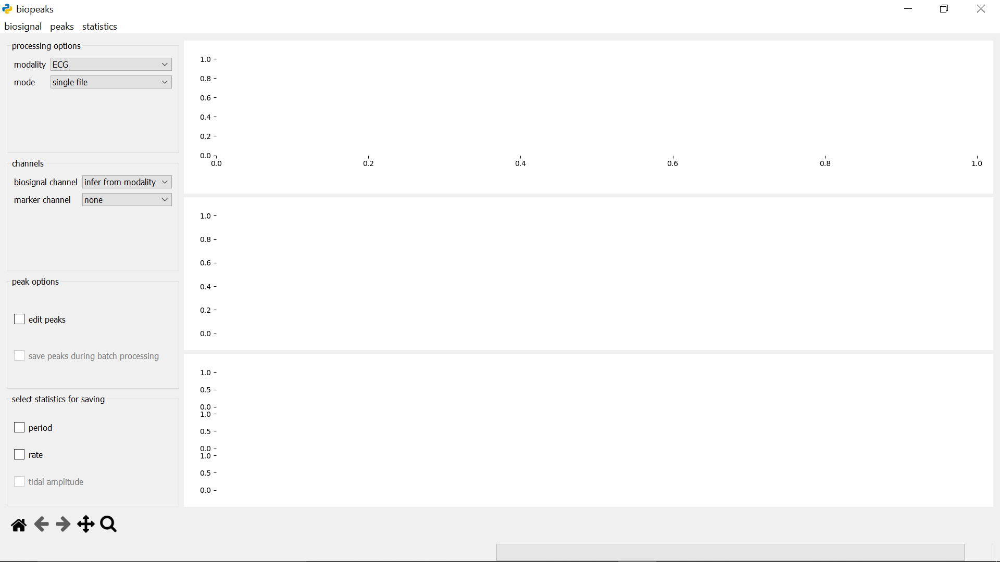
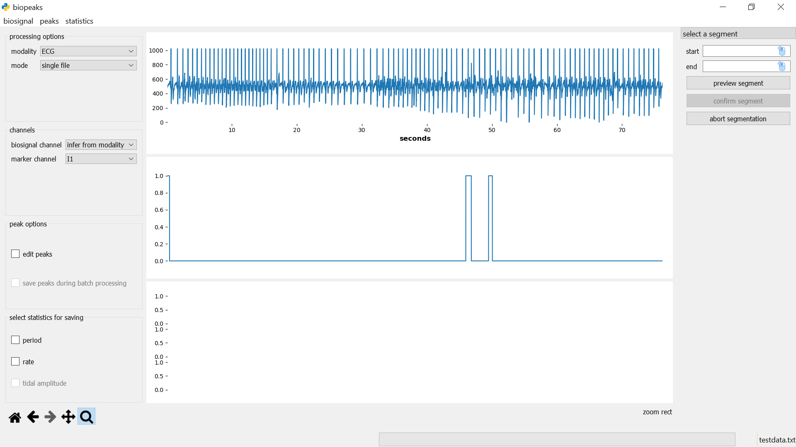
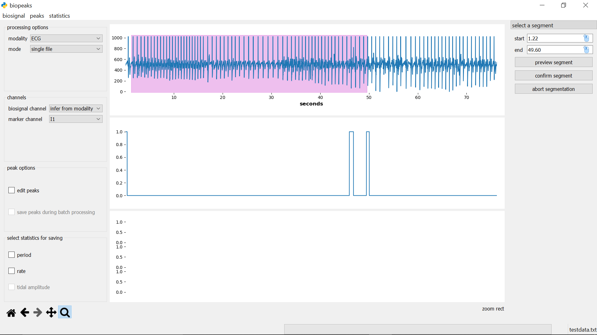
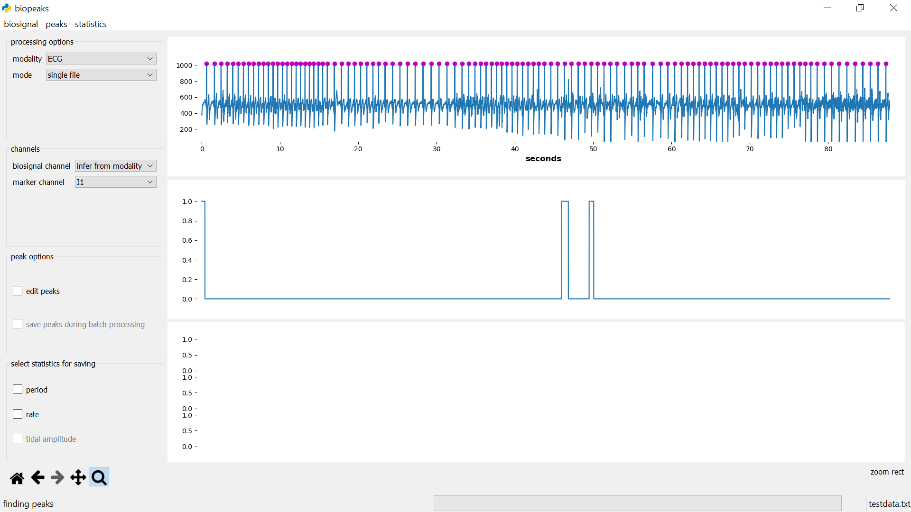
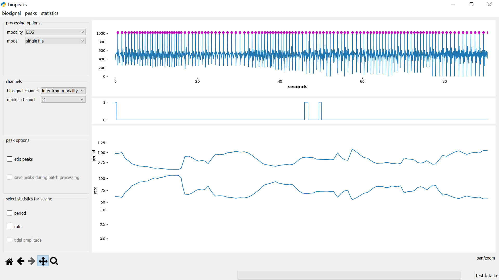
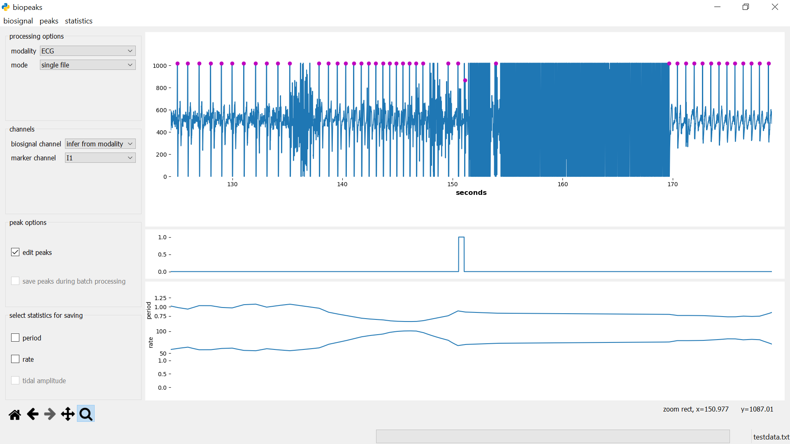

1. [General Information](#1.-General-Information)
2. [Citation](#2.-Citation)
3. [User Guide](#3.-User-Guide)
4. [Contributer Guide](#4.-Contributor-Guide)
5. [Tests](#5.-Tests)
6. [Changelog](#6.-Changelog)
7. [Further Resources](#7.-Further-Resources)


# 1. General Information

`biopeaks` is a graphical user interface for electrocardiogram (ECG) and breathing biosignals.
It processes these biosignals semi-automatically with sensible defaults and features the following
functionality:

* processing of the open biosignal formats [EDF](https://en.wikipedia.org/wiki/European_Data_Format)
as well as [OpenSignals](https://bitalino.com/en/software)
* biosignal visualization
* biosignal segmentation
* extrema detection (R-peaks in ECG, exhalation troughs and inhalation
peaks in breathing signals)
* state-of-the-art [automatic artifact correction](https://www.tandfonline.com/doi/full/10.1080/03091902.2019.1640306)
 for ECG extrema
* manual editing of extrema (useful in case of poor biosignal quality)
* calculation of instantaneous (heart- or breathing-) rate and period, as well as
breathing amplitude
* fully automated batch processing

# 2. Citation

[](https://www.zenodo.org/badge/latestdoi/172897525)

You can cite `biopeaks` as 
> Jan C. Brammer. (2020, March 6). JanCBrammer/biopeaks: Version 1.1.5 (Version v1.1.5). Zenodo. http://doi.org/10.5281/zenodo.3698562

# 3. User Guide

## Installation
Note that currently, `biopeaks` has been built and tested on Windows. It should
run on Linux and macOS as well and support for those platform will follow as soon
as possible.


### Instructions for users without a Python installation
If you don't have experience with installing Python packages and/or if you
aren't sure if you have Python on your computer start by setting up Python.
Go to https://www.anaconda.com/distribution/ and install the latest 
distribution for your operating system (make sure to choose "Python 3.7 version"
or greater).
Follow these [instructions](https://docs.anaconda.com/anaconda/install/)
in case you're unsure about the installation. Once you've installed Anaconda, open an
[Anaconda Prompt](https://docs.anaconda.com/anaconda/user-guide/getting-started/)
and type

```
pip install biopeaks
```

After the successful installation, open the application by typing
```
biopeaks
```
in the Anaconda Prompt.


### Instructions for users who already have a Python installation

#### dependencies
Make sure that the following requirements are met for your Python installation:

python >= 3.7\
numpy >= 1.17.3\
scipy >= 1.3.1\
pandas >= 0.25.3\
pyqt >= 5.12.3\
matplotlib >= 3.1.3

Once you have all the dependencies, install `biopeaks` with

```
pip install biopeaks
```


## Layout of the interface



In the **menubar**, you can find three sections: **_biosignal_**, **_peaks_**,
and **_statistics_**.
These contain methods for the interaction with your biosignals. On the left 
side, there's
an **optionspanel** that allows you to customize your workflow.
To the right of the **optionspanel** is the **datadisplay** which consists of 
three panels. The upper
panel contains the biosignal as well as peaks identified in the biosignal, 
while the middle panel can be used
to optionally display a marker channel. The lower panel contains any statistics 
derived from the peaks. Adjust the height of the panels by dragging the 
segmenters
between them up or down. Beneath the **optionspanel**, in the lower left
corner, you find the **displaytools**. These allow you to interact with the
biosignal. Have a
look in the [functionality section](#Functionality) for details on these
elements.

## Functionality

+ [load biosignal](#load-biosignal)
+ [segment biosignal](#segment-biosignal)
+ [save biosignal](#save-biosignal)
+ [find peaks](#find-peaks)
+ [save peaks](#save-peaks)
+ [load peaks](#load-peaks)
+ [edit peaks](#edit-peaks)
+ [calculate statistics](#calculate-statistics)
+ [save statistics](#save-statistics)
+ [batch processing](#batch-processing)
+ [display tools](#displaytools)


### load biosignal
Before loading the biosignal, you need to select the modality of your biosignal
in **optionspanel** -> **_processing options_** -> _modality_ (ECG for
electrocardiogram, and RESP for breathing). Next, under **optionspanel** -> **_channels_** you need to
specify which _biosignal channel_ contains the biosignal corresponding to your
modality. Optionally, in addition to the _biosignal channel_, you can select a
_marker channel_. This is useful if you recorded a channel
that marks interesting events such as the onset of an experimental condition,
button presses etc.. You can use the _marker channel_ to display any other
channel alongside your _biosignal channel_. Once these options are selected,
you can load the biosignal: **menubar** -> **_biosignal_** -> _load_. A
dialog will let you select the file containing the biosignal. The file format
(EDF or OpenSignals) is detected automatically. If the biosignal
has been loaded successfully it is displayed in the upper **datadisplay**. If
you selected a _marker channel_, the markers will be displayed in the middle
**datadisplay**. The current file name is always displayed in the lower right
corner of the interface.


### segment biosignal
**menubar** -> **_biosignal_** -> _select segment_ opens the **segmentdialog**
on the right side of the **datadisplay**.



Specify start and end of the segment in seconds either by entering values in
the respective fields, or with the mouse. For the latter option, first click on
the mouse icon in the respective field and then left-click anywhere on the
upper **datadisplay** to select a time point. To see which time point is
currently under the mouse cursor have a look at the x-coordinate
displayed in the lower right corner of the **datadisplay** (displayed when you hover 
the mouse over the upper **datadisplay**).
If you click **_preview segment_**
the segment will be displayed as a shaded region in the upper **datadisplay**
but the segment won't be cut out yet. 



You can change the start and end values
and preview the segment until you are certain that the desired segment is
selected. Then you can cut out the segment with **_confirm
segment_**. This also closes the **segmentdialog**. Alternatively, the
**segmentdialog** can be closed any time by clicking **_abort segmentation_**.
Clicking **_abort segmentation_** discards any values that might have been
selected. You can segment the biosignal at any time. Other data (peaks,
statistics) will be also be segmented if they are already computed. Note that
the selected segment must have a minimum duration of five seconds.

### save biosignal
**menubar** -> **_biosignal_** -> _save_ opens a file dialog that lets you
select a directory and file name for saving the biosignal.
Note that saving the biosignal is only possible after segmentation. The file is
saved in its original format containing all channels.

### find peaks
**menubar** -> **_peaks_** -> _find_ automatically identifies the peaks in the
biosignal. The peaks appear as dots displayed on top of the biosignal.



### save peaks
**menubar** -> **_peaks_** -> _save_ opens a file dialog that lets you select a
directory and file name for saving the peaks in a CSV file. The format of the
file depends on the _modality_. For ECG, `biopeaks` saves a column containing
the occurrences of R-peaks in seconds. The first element contains the header
"peaks". For breathing, `biopeaks` saves two columns containing the occurrences
of inhalation peaks and exhalation troughs respectively in seconds. The first
row contains the header "peaks, troughs". Note that if there are less peaks
than troughs or vice versa, the column with less elements will be padded with
a NaN.

### load peaks
**menubar** -> **_peaks_** -> _load_ opens a file dialog that lets you select
the file containing the peaks. Note that prior to loading the peaks, you have
to load the associated biosignal. Also, loading peaks won't work if there are
already peaks in memory (i.e., if there are already peaks displayed in the
upper **datadisplay**). Note that it's only possible to load peaks that have
been saved with `biopeaks` or adhere to the same format. The peaks appear as
dots displayed on top of the biosignal.

### calculate statistics
**menubar** -> **_statistics_** -> _calculate_ automatically calculates all
possible statistics for the selected _modality_. The statistics will be 
displayed in the lowest **datadisplay**.



### save statistics
First select the statistics that you'd like to save: **optionspanel** ->
**_select statictics for saving_**. Then, 
**menubar** -> **_statistics_** -> _save_, opens a file dialog
that lets you choose a directory and file name for saving a CSV file. The
format of the file depends on the _modality_. Irrespective
of the modality the first two columns contain period and rate (if both have
been chosen for saving).
For breathing, there will be an additional third column containing the tidal
amplitude (if it has been chosen for saving). The first row contains the
header. Note that the statistics are
interpolated to match the biosignal's timescale (i.e., they represent
instantaneous statistics sampled at the biosignal's sampling rate).

### edit peaks
It happens that the automatic peak detection places peaks wrongly. You can
catch these errors by visually inspecting the peak placement. If you spot
errors in peak placement you can correct those manually. To do so make sure to
select **optionspanel** -> **peak options** -> _edit peaks_. Now click on the
upper **datadisplay** once to enable peak editing. To delete a peak place the 
mouse cursor in it's vicinity and press "d". To add a peak,
press "a". Editing peaks is most convenient if you zoom in on the biosignal
region that you want to edit using the [**displaytools**](#displaytools).
The statistics
can be a useful guide when editing peaks. Isolated, unusually large or small
values in period or rate can indicate misplaced peaks. If the _modality_ is
ECG, peaks are corrected automatically during the
[calculation of the statistics](#calculate-statistics).
However, this does not guarantee that all errors in peak placement will
be caught. Always check for errors manually! Note, that when editing breathing
extrema, any edits that break the alternation of peaks and troughs
(e.g., two consecutive peaks) will automatically be discarded when you save
the extrema. If you already calculated statistics, don't forget to calculate
them again after peak editing.

### batch processing
> :warning: There is no substitute for manually checking the biosignal's
> quality as well as the placement of the peaks. Manually checking and editing
> peak placement is the only way to guarantee sensible statistics. Only use
> batch processing if you are sure that the biosignal's quality is sufficient!
> :warning:

You can configure your batch processing in the **optionspanel**.
To enable batch processing, select 
**_processing options_** -> _mode_ -> multiple files. Make sure to
select the correct _modality_ in the **_processing options_** as well. Also select
the desired _biosignal channel_ in **_channels_**. Further, indicate if you'd
like to save
the peaks during batch processing: **_peak options_** ->
_save peaks during batch processing_. Also, select the statistics you'd like
to save: **_select statictics for saving_**. Now, select
all files that should be included in the batch: **menubar** -> **_biosignal_**
-> _load_. A dialog will let you select the files (select multiple files with
the appropriate keyboard commands of your operating system). Next, a dialog
will ask you to choose a directory for saving the peaks (if you enabled that
option). The peaks will be saved to a file with the same name as the biosignal
file, with a "_peaks" extension.
Finally, a dialog will ask you to select a directory for saving the statistics
(if you chose any statistics for saving). The statistics will be saved to a
file
with the same name as the biosignal file, with a "_stats" extension. Once all
dialogs are closed, `biopeaks` carries out the following actions for each file
in the batch: loading the biosignal, identifying the
peaks, calculating the statistics and finally saving the desired data (peaks
and/or statistics). Note that nothing will be shown in the **datadisplay**
while the batch is processed. You can keep track of the progress by looking
at the file name displayed in the lower right corner of the interface.
Note that segmentation or peak editing are not possible during batch
processing.

### displaytools
The **displaytools** allow you to interact with the biosignal. Have a look
[here](https://matplotlib.org/3.1.1/users/navigation_toolbar.html) for a
detailed description of how to use them.


## Getting started
The following work-flow is meant as an introduction to the interface. Many other
work flows are possible and might make more sense given your 
requirements. Note that `biopeaks` works with the OpenSignals text file format
as well as EDF files. However, you can analyze any data as long as you format the
data according to either the [OpenSignals convention](http://bitalino.com/datasheets/OpenSignals_File_Formats.pdf)
or the [EDF convention](https://www.edfplus.info/specs/index.html). The functions
used in the examplary work-flow are described in detail in the [functionality section](#Functionality).

### examplary workflow on a single file
Time to look at some biosignals! Before you start any work-flow, set the desired
options in the **optionspanel**. Make sure that the **_processing mode_** is
set to _single file_ and [load the biosignal](#load-biosignal) to visually
check its quality using the [**displaytools**](#displaytools). Next, if you
want, you can
[segment the biosignal](#segment-biosignal) based on a specific time interval
or events in
the markers. Now, you can [identify the peaks](#find-peaks) in the biosignal.
If the
quality of the biosignal is sufficient, the peaks should be placed in the
correct locations. However, if there are noisy intervals in the biosignal,
peaks might be misplaced or not detected at all (i.e., false positives or
false negatives).



If this is the case you can [edit the
peak locations](#edit-peaks). Once you are confident that all the peaks are
placed
correctly you can [calculate statistics](#calculate-statistics). Finally,
you can [save the biosignal](#save-biosignal), [peaks](#save-peaks), and/or
[statistics](#save-statistics), depending on your requirements. If you have
segmented the biosignal it is a
good idea to save it so you can reproduce the workflow later if necessary.
Also, save the peaks if you're planning on [reloading](#load-peaks) them later
or using them for your own computations.


# 4. Contributor Guide
Please report any bug or question by [opening an issue](https://help.github.com/en/github/managing-your-work-on-github/creating-an-issue).
Pull requests for new features, improvements, and bug fixes are very welcome!

The application is structured according to a variant of the
[model-view-controller architecture](https://martinfowler.com/eaaDev/uiArchs.html).
To understand the relationship of the model, view, and controller have a look
at how each of them is instantiated in `__main__.py`. For
example, the view class has references to the model class as well as the
controller class, whereas the model has no reference to any of the other
components of the architecture (i.e., the model is agnostic to the view and
controller).

# 5. Tests
The test data have been recorded with\
software: opensignals v2.0.0, 20190805\
hardware: BITalino (r)evolution (firmware 1281)

The tests can be run from a Python console:
```
from biopeaks.test import frontend_test
frontend_test.runner()
```
This will open an application, run a few tests on it and print the results to
the Python console.

# 6. Changelog

### Version 1.1.5 (March 01, 2020)
+ enhancement: added support for [EDF files](https://en.wikipedia.org/wiki/European_Data_Format).
+ enhancement: `ecg.ecg_peaks()` now filters out power-line noise at 50Hz. This
further increases the performance on the [Glasgow University Database (GUDB)](http://researchdata.gla.ac.uk/716/).
Again, the GUBD has not been used to optimize `ecg.ecg_peaks()` in any way prior to
the performance evaluation. The tolerance for peak detection was set to one
sample.

|condition|metric     |summary|version 1.0.2|version 1.0.3|version 1.1.5
|:-------:|:---------:|:-----:|:-----------:|:-----------:|:-----------:
|sitting  |precision  |mean   |.999         |.998         |.998
|         |           |std    |.002         |.005         |.002
|         |sensitivity|mean   |.996         |.996         |.998
|         |           |std    |.008         |.004         |.004
|handbike |precision  |mean   |.904         |.930         |.984
|         |           |std    |.135         |.127         |.022
|         |sensitivity|mean   |.789         |.857         |.984
|         |           |std    |.281         |.247         |.025

### Version 1.0.5 (February 09, 2020)
+ enhancement: improved ECG artifact detection and correction.

### Version 1.0.4 (January 08, 2020)
+ bugfix: `controller.edit_peaks()` works properly again.
+ enhancement: moved the modality menu to processing options.

### Version 1.0.3 (December 26, 2019)
+ enhancement: improved sensitivity of `ecg.ecg_peaks()` without decreasing
precision in moderately dynamic conditions (handbike) while maintaining
high performance in resting conditions (sitting). Performance has been
evaluated on lead 2 of all 25 subjects in the [Glasgow University Database (GUDB)](http://researchdata.gla.ac.uk/716/).
The GUBD has not been used to optimize `ecg.ecg_peaks()` in any way prior to
the performance evaluation. The tolerance for peak detection was set to one
sample.

|condition|metric     |summary|version 1.0.2|version 1.0.3
|:-------:|:---------:|:-----:|:-----------:|:-----------:
|sitting  |precision  |mean   |.999         |.998         
|         |           |std    |.002         |.005         
|         |sensitivity|mean   |.996         |.996         
|         |           |std    |.008         |.004         
|handbike |precision  |mean   |.904         |.930         
|         |           |std    |.135         |.127         
|         |sensitivity|mean   |.789         |.857         
|         |           |std    |.281         |.247         

### Version 1.0.2 (December 1, 2019)
+ enhancement: `resp.resp_extrema()` is now based on zerocrossings and makes
fewer assumptions about breathing rate.

### Version 1.0.1 (November 28, 2019)
+ bugfix: `controller.save_signal()` now preserves the header if the data are
saved to the same location (i.e., if `model.rpathsignal` and `model.wpathsignal` are
identical).


# 7. Further Resources
Check out these free alternatives:
+ https://www.medisig.com/signalplant/
+ https://physiodatatoolbox.leidenuniv.nl/
+ http://www.artiifact.de/

