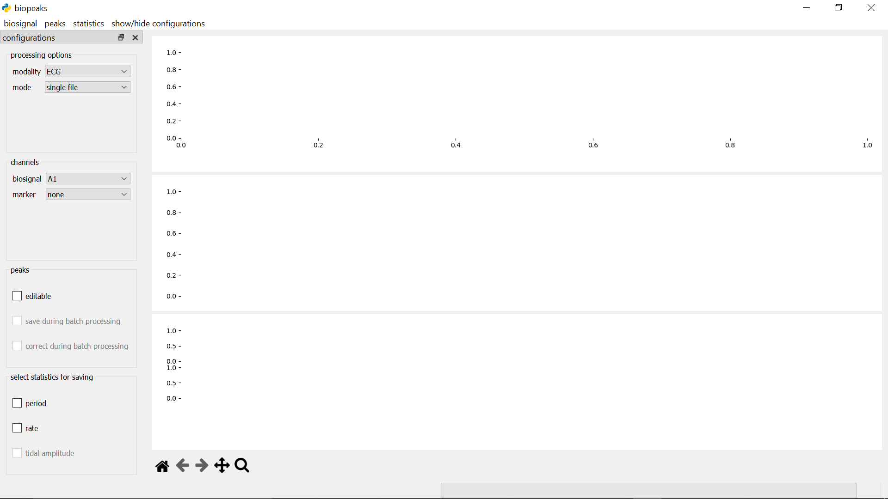
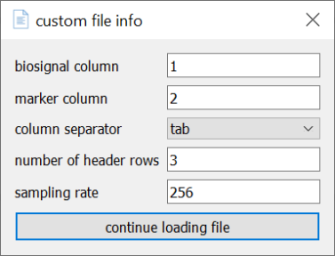
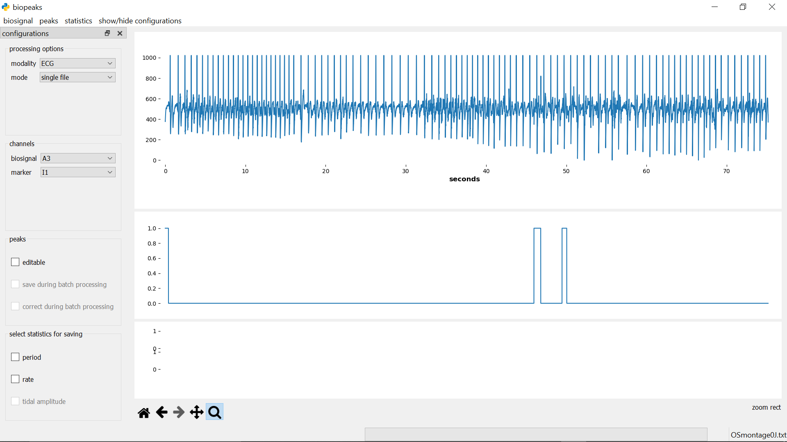
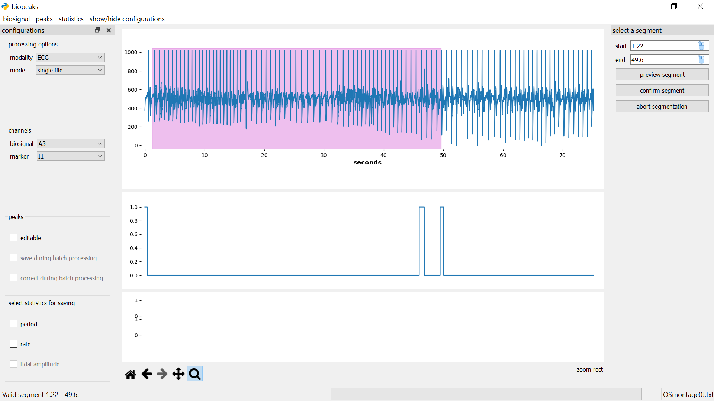
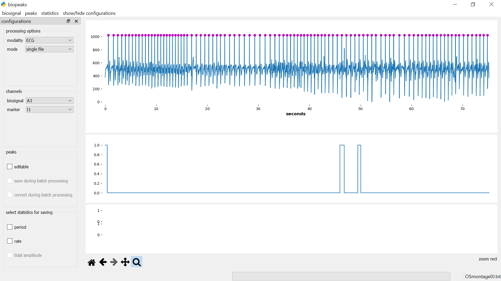
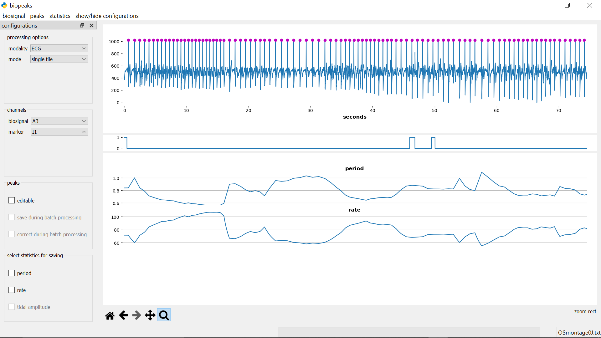

# User Guide

## Layout of the interface

In the **menubar**, you can find the sections **_biosignal_**, **_peaks_**,
and **_statistics_**. These contain methods for the interaction with your biosignals. On the left
side, there's a panel containing **configurations** that allows you to customize your workflow.
You can toggle the visibility of the **configurations** with **_show/hide configurations_** in the **menubar**.
To the right of the **configurations** is the **datadisplay** which consists of three panels. The upper
panel contains the biosignal as well as peaks identified in the biosignal, while the middle panel can be used
to optionally display a marker channel. The lower panel contains any statistics
derived from the peaks. Adjust the height of the panels by dragging the segmenters between them up or down.
Beneath the **datadisplay**, in the lower left corner, you find the **displaytools**. These allow you to interact with the
biosignal. Have a look in the [functionality section](#functionality) for details on these elements.

## Getting started
The following work-flows are meant as an introduction to the interface. Many other
work-flows are possible. Note that `biopeaks` works with the OpenSignals file format
as well as EDF files, and plain text files (.txt, .csv, .tsv) containing biosignal channels as columns. The functions
used in the exemplary work-flow are described in detail in the [functionality section](#functionality).

### extracting ECG features from an OpenSignals file

1. Download the [example data](https://github.com/JanCBrammer/biopeaks/blob/master/biopeaks/docs/example_data.txt) (click the `Download` button on the upper right).

2. Configure the processing options in the **configurations**:
    * Since we want to analyze ECG data, make sure that **_processing options_** -> _modality_ is set to "ECG".
    * Set **_processing options_** -> _mode_  to "single file".
    * Set **_channels_** -> _biosignal_ to "A3" (ECG has been recorded on analog channel 3) and _marker_ to "I1" (events have been marked in input channel 1).
3. Load the example data using **menubar** -> **_biosignal_** -> _load_ -> _Opensignals_. More details on loading data can be found [here](#load-biosignal).

4. Once the data has been loaded, lets select a segment. **menubar** -> **_biosignal_** -> _select segment_ opens the **segmentdialog** on the right side of the **datadisplay**. Select the segment from the second marker at 150 seconds to the end of the signal at 340 seconds by entering "150" and "340" in the `start` and `end` fields respectively. Click `preview segment` to verify that the correct segment has been selected. Now, click `confirm segment` to cut out the selection. Note that the original file is not affected by this. More details on segmenting can be found [here](#segment-biosignal).

5. Now you can identify the R-peaks using **menubar** -> **_peaks_** -> _find_. Around second 10, you'll notice irregularities in the placement of the R-peaks. Zoom in on the biosignal by clicking on the magnifying glass in the **displaytools**. You can now use the mouse cursor to draw a rectangle around the biosignal between seconds 5 and 20. This will result in the magnification of that segment. Note that zooming is easier when you enlarge the panel containing the biosignal by dragging down the gray segmenter underneath the panel. You'll see a slightly misplaced R-peak around second 11 as well as a missing R-peak at second 13. In the next two steps, we'll correct these R-peaks using manual and automatic correction. The functionality section contains more details on how to [find extrema](#find-peaks) and [use the displaytools](#displaytools).

6. First, lets use autocorrection: **menubar** -> **_peaks_** -> _autocorrect_. This corrects pronounced irregularities in the R-peaks, such as missing R-peaks or relatively large misplacements. You'll see that the autocorrection adds the missing R-peak at 13 seconds. However, it does not correct the subtle misplacement of the R-peak at 11 seconds. More details on the autocorrection can be found [here](#auto-correct-peaks).

7. To correct the misplacement at 11 seconds you can use manual peak editing. Check the box next to **configurations** -> **peak** -> _editable_. Now click on the biosignal panel once to enable peak editing. Delete the misplaced R-peak by placing the mouse cursor in it's vicinity and pressing "d" on your keyboard. Next, you can insert the R-peak at the correct position by placing the mouse cursor on the R-peak at 11 seconds and pressing "a". You can play around with adding and deleting peaks to get a feeling for how it works. More details on editing peaks can be found [here](#edit-peaks).

8. Now you're ready to extract heart period and heart rate by clicking **menubar** -> **_statistics_** -> _calculate_. Both statistics will be displayed in the lower panel of the **datadisplay**. More details on calculating statistics can be found [here](#calculate-statistics).

9.  Finally, to be able to reproduce your results, save the segment (**menubar** -> **_biosignal_** -> _save_), peaks (**menubar** -> **_peaks_** -> _save_), and statistics (**menubar** -> **_statistics_** -> _save_). Prior to saving the statistics, check the boxes next to the statistics that you'd like to save: **configurations** -> **_select statictics for saving_**. You can now use the statistics and/or peaks for further analysis such as averages or heart rate variability.

### extracting respiration features from a custom file

You can analyze any plain text file (.txt, .csv, .tsv) as long as it contains biosignal(s) as column(s).

1. Download the [example data](https://github.com/JanCBrammer/biopeaks/blob/master/biopeaks/docs/example_data.txt) (click the `Download` button on the upper right).

2. Configure the processing options in the **configurations**:
    * Since we want to analyze respiration data, make sure that **_processing options_** -> _modality_ is set to "RESP".
    * Set **_processing options_** -> _mode_  to "single file".

3. Load the example data using **menubar** -> **_biosignal_** -> _load_ -> _Custom_. This will pop up a dialog that prompts you for information about the custom file. First, you need to specify which column contains the biosignal. Since the respiration channel is recorded in column 6 of the example data, fill in "6" in the `biosignal column` field. Similarly, the marker we'd like to display is recorded in column 2. Since the columns of the example data file are separated by tabs, you can select "tab" from the `column separator` dropdown menu. If the data file contains a header, specify the `number of header rows`. The example data has 3 header rows. Finally, you need to specify the `sampling rate`. The example data has been recorded at 1000 Hz. Click `continue loading file` to select the example data file from your file system. More details on how to load a custom file can be found [here](#plain-text-files).

4. Once the biosignal and marker are displayed in the upper and lower **datadisplay** panels respectively, you can select a segment. **menubar** -> **_biosignal_** -> _select segment_ opens the **segmentdialog** on the right side of the **datadisplay**. Select the segment from the start of the recording (0 seconds) to the first marker at 95 seconds by entering "0" and "95" in the `start` and `end` fields respectively. Click `preview segment` to verify that the correct segment has been selected. Now, click `confirm segment` to cut out the selection. Note that the original file is not affected by this. More details on segmenting can be found [here](#segment-biosignal).

5. Now you can use **menubar** -> **_peaks_** -> _find_ to identify the breathing extrema.

6. Once the extrema are displayed on top of the biosignal, you're ready to extract breathing period, -rate, and -amplitude by clicking **menubar** -> **_statistics_** -> _calculate_. All three statistics will be displayed in the lower panel of the **datadisplay**. More details on calculating statistics can be found [here](#calculate-statistics).

7. Finally, to be able to reproduce your results, save the segment (**menubar** -> **_biosignal_** -> _save_), breathing extrema (**menubar** -> **_peaks_** -> _save_), and statistics (**menubar** -> **_statistics_** -> _save_). Prior to saving the statistics, check the boxes next to the statistics that you'd like to save: **configurations** -> **_select statictics for saving_**. You can now use the statistics and/or peaks for further analysis.

## Functionality

- [load biosignal](#load-biosignal)
  - [OpenSignals and EDF](#opensignals-and-edf)
  - [Plain text files](#plain-text-files)
- [segment biosignal](#segment-biosignal)
- [save biosignal](#save-biosignal)
- [find peaks](#find-peaks)
- [save peaks](#save-peaks)
- [load peaks](#load-peaks)
- [calculate statistics](#calculate-statistics)
- [save statistics](#save-statistics)
- [edit peaks](#edit-peaks)
- [auto-correct peaks](#auto-correct-peaks)
- [batch processing](#batch-processing)
- [displaytools](#displaytools)

### load biosignal
#### OpenSignals and EDF
Under **configurations** -> **_channels_**, specify which channel contains the
_biosignal_ corresponding to your modality. Optionally, in addition to the
_biosignal_, you can select a _marker_. This is useful if you recorded a channel
that marks interesting events such as the onset of an experimental condition,
button presses etc.. You can use the _marker_ to display any other
channel alongside your _biosignal_. Once these options are selected,
you can load the biosignal: **menubar** -> **_biosignal_** -> _load_ -> _Opensignals_ or _EDF_. A
dialog will let you select a file.
#### Plain text files
If you have a .txt, .csv, or .tsv file that contains biosignal channels as columns,
you can load a biosignal channel and optionally a marker channel using **menubar** -> **_biosignal_** -> _load_ -> _Custom_.
This will open a dialog that prompts you for some information.

Note that the fields _biosignal_column_, _number of header rows_, and _sampling rate_
are required, whereas _marker column_ is optional. In case your file doesn't have a header,
simply put "0" into the _number of header rows_ field. Also make sure to select the
correct _column separator_ ("comma" for .csv, "tab" for "tsv", "colon",
or "space" in case your columns are separated with these characters). Once you're done,
pressing _continue loading file_ opens another dialog that will let you select the file.

Once the biosignal has been loaded successfully it is displayed in the upper **datadisplay**. If
you selected a marker, it will be displayed in the middle **datadisplay**. The current file name is displayed in the lower right
corner of the interface. You can load a new biosignal from either the same file (i.e., another channel)
or a different file at any time. Note however that this will remove all data that is currently in the interface.

### segment biosignal
**menubar** -> **_biosignal_** -> _select segment_ opens the **segmentdialog**
on the right side of the **datadisplay**.

Specify the start and end of the segment in seconds either by entering values,
or with the mouse. For the latter option, first click on
the mouse icon in the respective field and then left-click anywhere on the
upper **datadisplay** to select a time point. To see which time point is
currently under the mouse cursor have a look at the x-coordinate
displayed in the lower right corner of the **datadisplay** (displayed when you hover
the mouse over the upper **datadisplay**). If you click **_preview segment_**
the segment will be displayed as a shaded region in the upper **datadisplay**
but the segment won't be cut out yet.

You can change the start and end values and preview the segment until you are certain that the desired segment is
selected. Then you can cut out the segment with **_confirm segment_**. This also closes the **segmentdialog**. Alternatively, the
**segmentdialog** can be closed any time by clicking **_abort segmentation_**.
Clicking **_abort segmentation_** discards any values that might have been
selected. You can segment the biosignal multiple times. Other data (peaks,
statistics) will be also be segmented if they are already computed. Note that
the selected segment must have a minimum duration of five seconds. Also, after
the segmentation, the signal starts at second 0 again. That is, relative timing
is not preserved during segmentation. The original file is not affected by the segmentation.

### save biosignal
**menubar** -> **_biosignal_** -> _save_ opens a dialog that lets you
select a directory and file name for saving the biosignal.
Note that saving the biosignal is only possible after segmentation. The file is
saved in its original format containing all channels.

### find peaks
Before identifying peaks, you need to select the modality of your biosignal
in **configurations** -> **_processing options_** -> _modality_ ("ECG" for
electrocardiogram, "PPG" for photoplethysmogram, and "RESP" for breathing).
This is important since `biopeaks` uses modality-specific peak detectors.
Then, **menubar** -> **_peaks_** -> _find_ automatically identifies the peaks in the
biosignal. The peaks appear as dots displayed on top of the biosignal.

### save peaks
**menubar** -> **_peaks_** -> _save_ opens a file dialog that lets you select a
directory and file name for saving the peaks to a CSV file. The format of the
file depends on the _modality_. For ECG and PPG, `biopeaks` saves a column containing
the occurrences of R-peaks or systolic peaks respectively in seconds. The first element contains the header
"peaks". For breathing, `biopeaks` saves two columns containing the occurrences
of inhalation peaks and exhalation troughs respectively in seconds. The first
row contains the header "peaks, troughs". Note that if there are less peaks
than troughs or vice versa, the column with less elements will be padded with
a NaN.

### load peaks
**menubar** -> **_peaks_** -> _load_ opens a file dialog that lets you select
the file containing the peaks. Note that prior to loading the peaks, you have
to load the associated biosignal. Also, loading peaks won't work if there are
already peaks in memory (i.e., if there are already peaks displayed in the
upper **datadisplay**). Note that it's only possible to load peaks that have
been saved with `biopeaks` or adhere to the same format. The peaks appear as
dots displayed on top of the biosignal.

### calculate statistics
**menubar** -> **_statistics_** -> _calculate_ automatically calculates all
possible statistics for the selected _modality_. The statistics will be
displayed in the lowest **datadisplay**.

### save statistics
First select the statistics that you'd like to save: **configurations** ->
**_select statictics for saving_**. Then,
**menubar** -> **_statistics_** -> _save_, opens a file dialog
that lets you choose a directory and file name for saving a CSV file. The
format of the file depends on the _modality_. Irrespective
of the modality the first two columns contain period and rate (if both have
been chosen for saving).
For breathing, there will be an additional third column containing the tidal
amplitude (if it has been chosen for saving). The first row contains the
header. Note that the statistics are linearly interpolated to match the biosignal's
timescale (i.e., they represent instantaneous statistics sampled at the biosignal's sampling rate).

### edit peaks
It happens that the automatic peak detection places peaks wrongly or fails to
detect some peaks. You can
catch these errors by visually inspecting the peak placement. If you spot
errors in peak placement you can correct those manually. To do so make sure to
select **configurations** -> **peak** -> _editable_. Now click on the
upper **datadisplay** once to enable peak editing. To delete a peak place the
mouse cursor in it's vicinity and press "d". To add a peak,
press "a". Editing peaks is most convenient if you zoom in on the biosignal
region that you want to edit using the [**displaytools**](#displaytools).
The statistics in the lowest **datadisplay**
can be a useful guide when editing peaks. Isolated, unusually large or small
values in period or rate can indicate misplaced peaks. Note, that when editing breathing
extrema, any edits that break the alternation of peaks and troughs
(e.g., two consecutive peaks) will automatically be discarded when you save
the extrema. If you already calculated statistics, don't forget to calculate
them again after peak editing.

### auto-correct peaks
If the _modality_ is ECG or PPG, you can automatically correct the peaks with
**menubar** -> **_peaks_** -> _autocorrect_. Note that the auto-correction tries
to spread the peaks evenly across the signal which can lead to peaks that are
slightly misplaced. Also, the auto-correction does not guarantee that
all errors in peak placement will be caught. It is always good to check for errors manually!

### batch processing
> There is no substitute for manually checking the biosignal's
> quality as well as the placement of the peaks. Manually checking and editing
> peak placement is the only way to guarantee sensible statistics. Only use
> batch processing if you are sure that the biosignal's quality is sufficient!

You can configure the batch processing in the **configurations**.
To enable batch processing, select
**_processing options_** -> _mode_ -> "multiple files". Make sure to
select the correct _modality_ in the **_processing options_** as well. Also select
the desired _biosignal channel_ in **_channels_** (for custom files you can
specify the _biosignal_column_ in the file dialog while loading the files). Further, indicate if you'd
like to save the peaks during batch processing: **_peak options_** ->
_save during batch processing_. You can also choose to apply the auto-correction
to the peaks by selecting **_peak options_** ->
_correct during batch processing_. Also, select the statistics you'd like
to save: **_select statictics for saving_**. Now, select
all files that should be included in the batch: **menubar** -> **_biosignal_**
-> _load_. A dialog will let you select the files (select multiple files with
the appropriate keyboard commands of your operating system). Next, a dialog
will ask you to choose a directory for saving the peaks (if you enabled that
option). The peaks will be saved to a file with the same name as the biosignal
file, with a "_peaks.csv" extension.
Finally, a dialog will ask you to select a directory for saving the statistics
(if you chose any statistics for saving). The statistics will be saved to a
file with the same name as the biosignal file, with a "_stats.csv" extension. Once all
dialogs are closed, `biopeaks` carries out the following actions for each file
in the batch: loading the biosignal, identifying the
peaks, calculating the statistics and finally saving the desired data (peaks
and/or statistics). Note that nothing will be shown in the **datadisplay**
while the batch is processed. You can keep track of the progress by looking
at the file name displayed in the lower right corner of the interface.
Note that segmentation or peak editing are not possible during batch
processing.

### displaytools
The **displaytools** allow you to interact with the biosignal. Have a look
[here](https://matplotlib.org/3.1.1/users/navigation_toolbar.html) for a
detailed description of how to use them.
