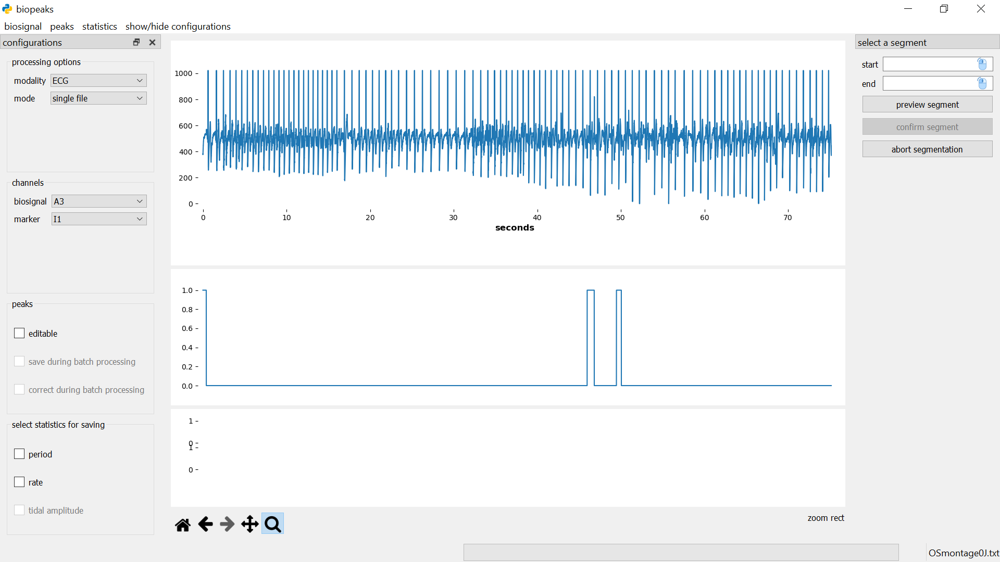

# User Guide

## Layout of the interface

In the **menubar**, you can find the sections **_biosignal_**, **_peaks_**,
and **_statistics_**. These contain methods for the interaction with your biosignals. On the left 
side, there's a panel containing **configurations** that allows you to customize your workflow.
You can toggle the visibility of the **configurations** with **_show/hide configurations_** in the **menubar**.
To the right of the **configurations** is the **datadisplay** which consists of three panels. The upper
panel contains the biosignal as well as peaks identified in the biosignal, while the middle panel can be used
to optionally display a marker channel. The lower panel contains any statistics 
derived from the peaks. Adjust the height of the panels by dragging the segmenters between them up or down.
Beneath the **datadisplay**, in the lower left corner, you find the **displaytools**. These allow you to interact with the
biosignal. Have a look in the [functionality section](#functionality) for details on these elements.

## Getting started
The following work-flow is meant as an introduction to the interface. Many other
work flows are possible and might make more sense given your 
requirements. Note that `biopeaks` works with the OpenSignals text file format
as well as EDF files. However, you can analyze any data as long as you format the
data according to either the [OpenSignals convention](http://bitalino.com/datasheets/OpenSignals_File_Formats.pdf)
or the [EDF convention](https://www.edfplus.info/specs/index.html). The functions
used in the exemplary work-flow are described in detail in the [functionality section](#functionality).

### examplary workflow on a single file
Before you start, select the desired options in the **configurations**. Make sure
that **_processing options_** -> _mode_  is set to "single file" and
[load the biosignal](#load-biosignal) to visually check its quality using the [**displaytools**](#displaytools).
Next, you could [segment the biosignal](#segment-biosignal) based on a specific time interval
or events in the markers. Now you can [identify the peaks](#find-peaks) in the biosignal.
If the quality of the biosignal is sufficient, the peaks should be placed in the
correct locations. However, if there are noisy intervals in the biosignal, peaks might be
misplaced or not detected at all (i.e., false positives or false negatives).

If this is the case you can [edit the peak locations](#edit-peaks). Once you are
confident that all the peaks are placed correctly you can [calculate statistics](#calculate-statistics).
Finally, you can [save the biosignal](#save-biosignal), [peaks](#save-peaks), and/or
[statistics](#save-statistics), depending on your requirements. If you have
segmented the biosignal it is a good idea to save it so you can reproduce the work-flow
later if necessary. Also, save the peaks if you're planning on [reloading](#load-peaks) them later
or using them for your own computations (e.g., heart rate variability).

## Functionality

+ [load biosignal](#load-biosignal)
+ [segment biosignal](#segment-biosignal)
+ [save biosignal](#save-biosignal)
+ [find peaks](#find-peaks)
+ [save peaks](#save-peaks)
+ [load peaks](#load-peaks)
+ [edit peaks](#edit-peaks)
+ [auto-correct peaks](#auto-correct-peaks)
+ [calculate statistics](#calculate-statistics)
+ [save statistics](#save-statistics)
+ [batch processing](#batch-processing)
+ [display tools](#displaytools)

### load biosignal
Before loading the biosignal, you need to select the modality of your biosignal
in **configurations** -> **_processing options_** -> _modality_ ("ECG" for
electrocardiogram, "PPG" for photoplethysmogram, and "RESP" for breathing).
Next, under **configurations** -> **_channels_** you need to
specify which channel contains the _biosignal_ corresponding to your
modality. Optionally, in addition to the _biosignal_, you can select a
_marker_. This is useful if you recorded a channel
that marks interesting events such as the onset of an experimental condition,
button presses etc.. You can use the _marker_ to display any other
channel alongside your _biosignal_. Once these options are selected,
you can load the biosignal: **menubar** -> **_biosignal_** -> _load_. A
dialog will let you select the file containing the biosignal. The file format
(EDF or OpenSignals) is detected automatically. If the biosignal
has been loaded successfully it is displayed in the upper **datadisplay**. If
you selected a _marker_, it will be displayed in the middle
**datadisplay**. The current file name is always displayed in the lower right
corner of the interface. You can load a new biosignal from either the same file (i.e., another channel)
or a different file at any time. Note however that this will remove all data that is currently in the interface.

### segment biosignal
**menubar** -> **_biosignal_** -> _select segment_ opens the **segmentdialog**
on the right side of the **datadisplay**.

Specify the start and end of the segment in seconds either by entering values in
the respective fields, or with the mouse. For the latter option, first click on
the mouse icon in the respective field and then left-click anywhere on the
upper **datadisplay** to select a time point. To see which time point is
currently under the mouse cursor have a look at the x-coordinate
displayed in the lower right corner of the **datadisplay** (displayed when you hover 
the mouse over the upper **datadisplay**). If you click **_preview segment_**
the segment will be displayed as a shaded region in the upper **datadisplay**
but the segment won't be cut out yet. 

You can change the start and end values and preview the segment until you are certain that the desired segment is
selected. Then you can cut out the segment with **_confirm segment_**. This also closes the **segmentdialog**. Alternatively, the
**segmentdialog** can be closed any time by clicking **_abort segmentation_**.
Clicking **_abort segmentation_** discards any values that might have been
selected. You can segment the biosignal multiple times. Other data (peaks,
statistics) will be also be segmented if they are already computed. Note that
the selected segment must have a minimum duration of five seconds. Also, after
the segmentation, the signal starts at second 0 again. That is, relative timing
is not preserved during segmentation.

### save biosignal
**menubar** -> **_biosignal_** -> _save_ opens a file dialog that lets you
select a directory and file name for saving the biosignal.
Note that saving the biosignal is only possible after segmentation. The file is
saved in its original format containing all channels.

### find peaks
First make sure that the correct modality is selected in **configurations** -> **_processing options_** -> _modality_, 
since `biopeaks` uses a modality-specific peak detector.
Then, **menubar** -> **_peaks_** -> _find_ automatically identifies the peaks in the
biosignal. The peaks appear as dots displayed on top of the biosignal. 

### save peaks
**menubar** -> **_peaks_** -> _save_ opens a file dialog that lets you select a
directory and file name for saving the peaks to a CSV file. The format of the
file depends on the _modality_. For ECG and PPG, `biopeaks` saves a column containing
the occurrences of R-peaks or systolic peaks respectively in seconds. The first element contains the header
"peaks". For breathing, `biopeaks` saves two columns containing the occurrences
of inhalation peaks and exhalation troughs respectively in seconds. The first
row contains the header "peaks, troughs". Note that if there are less peaks
than troughs or vice versa, the column with less elements will be padded with
a NaN.

### load peaks
**menubar** -> **_peaks_** -> _load_ opens a file dialog that lets you select
the file containing the peaks. Note that prior to loading the peaks, you have
to load the associated biosignal. Also, loading peaks won't work if there are
already peaks in memory (i.e., if there are already peaks displayed in the
upper **datadisplay**). Note that it's only possible to load peaks that have
been saved with `biopeaks` or adhere to the same format. The peaks appear as
dots displayed on top of the biosignal.

### calculate statistics
**menubar** -> **_statistics_** -> _calculate_ automatically calculates all
possible statistics for the selected _modality_. The statistics will be 
displayed in the lowest **datadisplay**.

### save statistics
First select the statistics that you'd like to save: **configurations** ->
**_select statictics for saving_**. Then, 
**menubar** -> **_statistics_** -> _save_, opens a file dialog
that lets you choose a directory and file name for saving a CSV file. The
format of the file depends on the _modality_. Irrespective
of the modality the first two columns contain period and rate (if both have
been chosen for saving).
For breathing, there will be an additional third column containing the tidal
amplitude (if it has been chosen for saving). The first row contains the
header. Note that the statistics are linearly interpolated to match the biosignal's
timescale (i.e., they represent instantaneous statistics sampled at the biosignal's sampling rate).

### edit peaks
It happens that the automatic peak detection places peaks wrongly or fails to
detect some peaks. You can
catch these errors by visually inspecting the peak placement. If you spot
errors in peak placement you can correct those manually. To do so make sure to
select **configurations** -> **peak** -> _editable_. Now click on the
upper **datadisplay** once to enable peak editing. To delete a peak place the 
mouse cursor in it's vicinity and press "d". To add a peak,
press "a". Editing peaks is most convenient if you zoom in on the biosignal
region that you want to edit using the [**displaytools**](#displaytools).
The statistics in the lowest **datadisplay**
can be a useful guide when editing peaks. Isolated, unusually large or small
values in period or rate can indicate misplaced peaks. Note, that when editing breathing
extrema, any edits that break the alternation of peaks and troughs
(e.g., two consecutive peaks) will automatically be discarded when you save
the extrema. If you already calculated statistics, don't forget to calculate
them again after peak editing.

### auto-correct peaks
If the _modality_ is ECG or PPG, you can automatically correct the peaks with
**menubar** -> **_peaks_** -> _autocorrect_. Note that the auto-correction tries
to spread the peaks evenly across the signal which can lead to peaks that are
slightly misplaced. Also, the auto-correction does not guarantee that
all errors in peak placement will be caught. It is always good to check for errors manually!
 
### batch processing
> There is no substitute for manually checking the biosignal's
> quality as well as the placement of the peaks. Manually checking and editing
> peak placement is the only way to guarantee sensible statistics. Only use
> batch processing if you are sure that the biosignal's quality is sufficient!

You can configure your batch processing in the **configurations**.
To enable batch processing, select 
**_processing options_** -> _mode_ -> "multiple files". Make sure to
select the correct _modality_ in the **_processing options_** as well. Also select
the desired _biosignal channel_ in **_channels_**. Further, indicate if you'd
like to save the peaks during batch processing: **_peak options_** ->
_save during batch processing_. You can also choose to apply the auto-correction
to the peaks by selecting **_peak options_** ->
_correct during batch processing_. Also, select the statistics you'd like
to save: **_select statictics for saving_**. Now, select
all files that should be included in the batch: **menubar** -> **_biosignal_**
-> _load_. A dialog will let you select the files (select multiple files with
the appropriate keyboard commands of your operating system). Next, a dialog
will ask you to choose a directory for saving the peaks (if you enabled that
option). The peaks will be saved to a file with the same name as the biosignal
file, with a "_peaks.csv" extension.
Finally, a dialog will ask you to select a directory for saving the statistics
(if you chose any statistics for saving). The statistics will be saved to a
file with the same name as the biosignal file, with a "_stats.csv" extension. Once all
dialogs are closed, `biopeaks` carries out the following actions for each file
in the batch: loading the biosignal, identifying the
peaks, calculating the statistics and finally saving the desired data (peaks
and/or statistics). Note that nothing will be shown in the **datadisplay**
while the batch is processed. You can keep track of the progress by looking
at the file name displayed in the lower right corner of the interface.
Note that segmentation or peak editing are not possible during batch
processing.

### displaytools
The **displaytools** allow you to interact with the biosignal. Have a look
[here](https://matplotlib.org/3.1.1/users/navigation_toolbar.html) for a
detailed description of how to use them.
