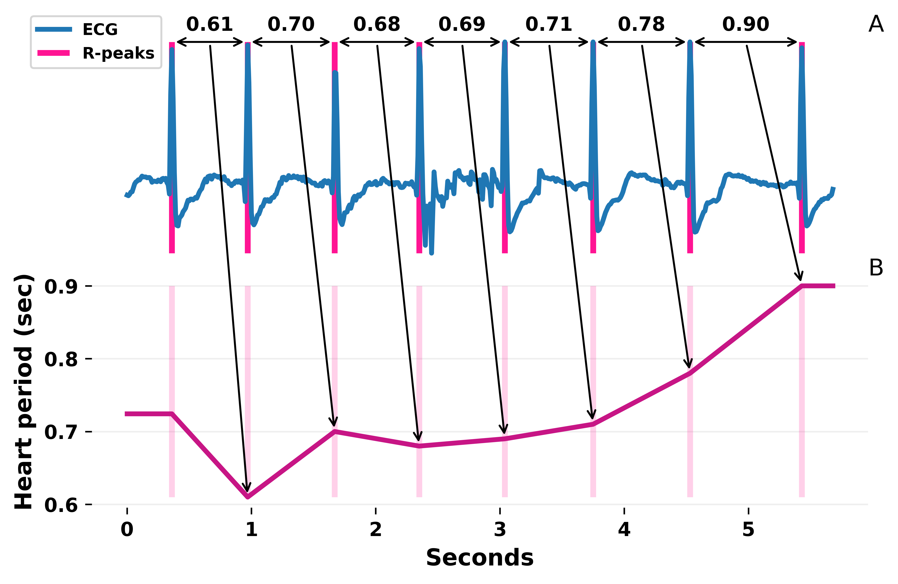
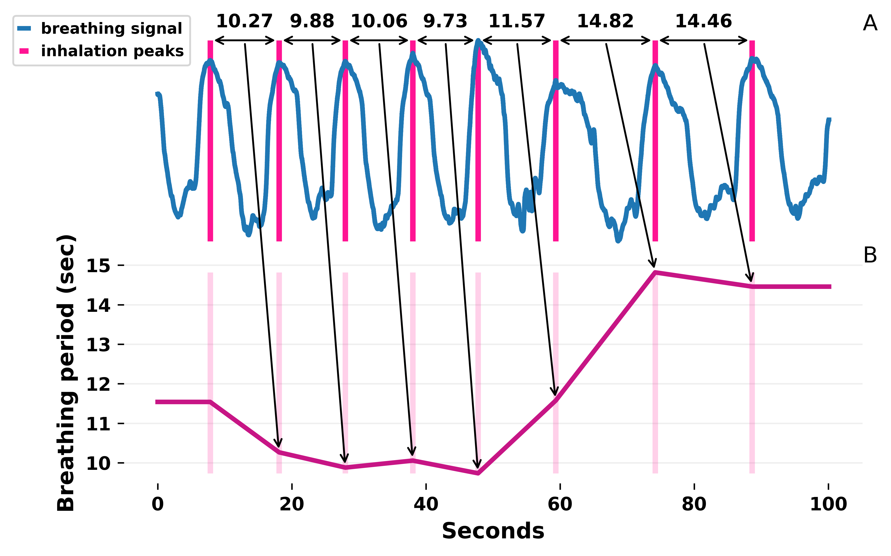
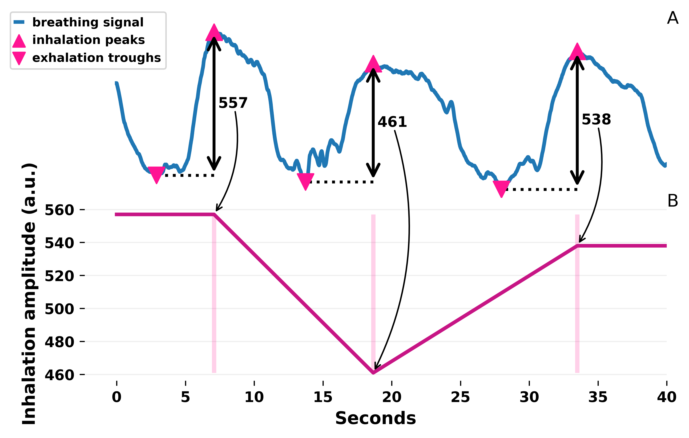

# Statement of need

Physiological measurements increasingly gain popularity in academia and industry, sparked by the availability of
easy-to-use, low-cost biosignal sensors along with a growing ecosystem of free,
open-source software for the analysis of biosignals [@neurokit; @biosppy]. However, an open-source, freely
available graphical user interfaces (GUI) for heart-and breathing biosignal analysis is currenly lacking. `biopeaks` addresses this need.
Compared to application programming interfaces [@neurokit; @biosppy], its GUI allows for
more intuitive and immediate visual interaction with the biosignal, which is especially valuable
during data preprocessing and exploration. At the time of writing, `biopeaks` is used in multiple projects at the [Gemhlab](https://gemhlab.com/).

# Functionality

+ processing of open biosignal formats EDF [@edf], OpenSignals [@opensignals], as well as plain text files (.txt, .csv, .tsv)
+ interactive biosignal visualization
+ biosignal segmentation
+ automatic extrema detection (R-peaks in electrocardiogram (ECG), systolic peaks in photoplethysmogram (PPG), as well as exhalation troughs and inhalation peaks in breathing signals)
with signal-specific, sensible defaults
+ automatic state-of-the-art artifact correction for ECG and PPG extrema
+ point-and-click editing of extrema
+ extraction of instantaneous features: rate and period for heart and breathing biosignals, as well as breathing amplitude
+ automatic analysis of multiple files (batch processing)
+ .csv export of extrema and instantaneous features for further analysis (e.g., heart rate variability)

An analyst who wants to extract information from heart or breathing biosignals performs multiple analysis steps.
First, they verify if the biosignal's quality is sufficient for analysis, since biosignals can be corrupted
for a number of reasons (e.g., movement artifacts, poor sensor placement). `biopeaks` allows
the analyst to quickly visualize a biosignal and interact with it (panning, zooming) to evaluate its quality.
If the analyst deems the biosignal's quality sufficient, they proceed to identify local extrema in the physiological time series.
Local extrema include R-peaks in ECG and systolic peaks in PPG, representing
the contraction of the ventricular heart muscle and subsequent ejection of blood to the arteries. In breathing biosignals,
the relevant local extrema are inhalation peaks and exhalation troughs. `biopeaks` detects these extrema automatically
using three modality-specific algorithms. Breathing extrema are detected using a variant of the "zero-crossing algorithm
with amplitude threshold" [@khodadad]. Systolic peaks in PPG signals are identified using an implementation of "Method IV;
Event-Related Moving Averages with Dynamic Threshold" introduced by Elgendi et al. [@elgendi]. Lastly, the ECG R-peak detector is a
custom algorithm that has been evaluated on the Glasgow University Database (GUDB) [@gudb] which contains ECG signals along with R-peak annotations. The performance of the R-peak detector has been evaluated in terms of sensitivity (aka recall; i.e., how many of the correct extrema were detected?) and precision (i.e., how many of the detected extrema are correct extrema?). Peak detection has been evaluated on Einthoven lead II of all 25 records, with a tolerance of 1 sample for true positive peak detection. The GUDB has not been used to optimize the R-peak detector prior to the performance evaluation. The performance at rest (sitting) and in dynamic conditions (handbike) is as follows:

|           |    |sitting|handbike|
|:---------:|:--:|:-----:|:------:|
|precision  |mean|.998   |.984    |
|           |std |.002   |.022    |
|sensitivity|mean|.998   |.984    |
|           |std |.004   |.025    |

The code for performance evaluation is included in the `biopeaks` installation and can be run without downloading the GUDB (database is streamed).
Despite the robust performance of the extrema detectors, algorithmically identified extrema can be misplaced (false positives) or extrema might be missed (false negatives),
if there are noisy segments in the biosignal. If left uncorrected, these errors can significantly distort subsequent analysis steps [@berntson]. To adress this problem and ensure the correct placement of extrema, `biopeaks` offers intuitive
point-and-click extrema editing (i.e., removing and adding extrema). Additionally, for cardiac biosignals,
`biopeaks` offers state-of-the-art automatic extrema correction [@lipponen]. Finally, based on the local extrema, the analyst can extract features
from the biosignal. The features are based on temporal or amplitude differences between the local extrema.
\autoref{Figure 1}, \autoref{Figure 2}, and \autoref{Figure 3} illustrate the extraction of instantaneous heart period, breathing period, and breathing (inhalation) amplitude respectively.

In summary, `biopeaks` is designed to make heart- and breathing biosignal inspection, extrema detection and editing, as well as feature
extraction fast and intuitive. It does not aim to offer a suite of low-level signal processing tools (e.g., digital filter design),
and abstracts these details away with sensible biosignal-specific defaults. `biopeaks` is implemented in Python using the cross-platform
PySide2 framework (official Python bindings for Qt) [@pyside2], and leverages matplotlib [@matplotlib], numpy [@numpy], scipy [@scipy] and pandas [@pandas] for visualization and signal processing.
There are freely available alternatives to `biopeaks` that are implemented in MATLAB [@artiifact; @physiodatatoolbox] or C# [@signalplant].
However, the source code of these tools is not available [@artiifact; @signalplant] or they are not released under an open
source license [@artiifact; @physiodatatoolbox; @signalplant].

# Acknowledgements
Nastasia Griffioen, Babet Halberstadt, Joanneke Weerdmeester, and Abele Michela provided invaluable feedback throughout the development of `biopeaks`.

# References