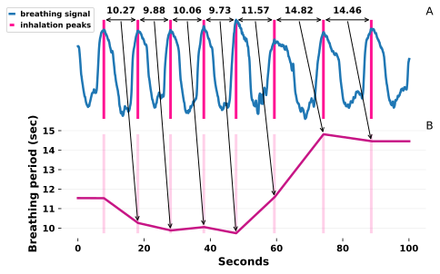
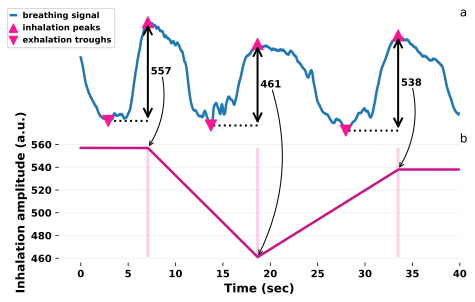

The recording of heart and breathing biosignals has become affordable and relatively easy to do.
Consequently, a growing number of academic fields and industries include these physiological measurements
in research and development. Complementary to the availability of low-cost sensors, there is a growing
ecosystem of free, open-source tools for the analysis of biosignals [@neurokit; @biosppy].
However, these tools do not offer graphical user interfaces (GUI). `biopeaks` addresses this need.
Compared to application programming interfaces, a GUI allows for more intuitive and immediate interaction
with the biosignal throughout its analysis.

An analyst who wants to extract information from heart or breathing biosignals must perform multiple steps.
First, they must verify if the biosignals' quality is sufficient for analysis. Biosignals can be corrupted
for a number of reasons, including movement artifacts, poor sensor placement and many more. `biopeaks` allows
the analyst to quickly visualize a biosignal and interact with it (panning, zooming) to evaluate its quality.
If the analyst deems the biosignal's quality sufficient they proceed to identify local extrema.
Local extrema include R-peaks in electrocardiogram (ECG) and systolic peaks in photoplethysmogram (PPG), representing
the contraction of the ventricular heart muscle and subsequent ejection of blood. In breathing biosignals,
the relevant local extrema are inhalation peaks and exhalation troughs.
`biopeaks` detects these extrema automatically with sensible algorithmic defaults. If there are noisy segments in the biosignal,
algorithmically identified extrema can be misplaced (false positives) or extrema might be missed (false negatives).
If left uncorrected, these errors significantly distort the subsequent analysis steps [@].`biopeaks` offers intuitive manual extrema editing
(i.e., removing and adding extrema) to ensure the correct placement of extrema. Additionally, for cardiac biosignals,
`biopeaks` offers state-of-the-art automatic extrema correction [@lipponen]. Finally, based on the extrema, the analyst
can extract features from the biosignal. The features are based on temporal or amplitude differences between the extrema.
For example, Fig. 1 through 3 illustrate the extraction of instantaneous heart period, breathing period, and breathing
(inhalation) amplitude respectively.

*Figure 1*: Extraction of heart period (panel b) based on R-peaks in an ECG (panel a). Note that this is conceptually identical to the extraction
of heart period based on systolic peaks in PPG.

*Figure 2*: Extraction of breathing period (panel b) based on inhalation peaks in a breathing signal (panel a).

*Figure 3*: Extraction of inhalation amplitude (panel b) based on breathing extrema in a breathing signal (panel a).

In summary, `biopeaks` is designed to make biosignal inspection, extrema detection and editing, as well as feature
extraction as fast and intuitive as possible. It is a pure Python implementation using the cross-platform
PyQt5 framework. `biopeaks` is built on matplotlib [@matplotlib], numpy [@numpy], scipy [@scipy] and pandas [@pandas].

The GUI has the following functionality:
+ works with files in the open biosignal formats EDF [@edf] as well as OpenSignals [@opensignals]
+ interactive biosignal visualization
+ biosignal segmentation
+ automatic extrema detection (R-peaks in ECG, systolic peaks in PPG, as well as exhalation troughs and inhalation peaks in breathing signals)
with signal-specific, sensible defaults
+ automatic state-of-the-art artifact correction for ECG and PPG extrema [@lipponen]
+ manual editing of extrema
+ extraction of instantaneous features: (heart- or breathing-) rate and period, as well as breathing amplitude
+ few steps from raw biosignal to feature extraction
+ does not require knowledge of (biomedical) digital signal processing
+ automatic analysis of multiple files (batch processing)
+ .csv export of extrema and instantaneous features for further analysis (e.g., heart rate variability)

There are free alternatives to `biopeaks` that do not require a (Matlab) license [@artiifact; @physiodatatoolbox; @signalplant].
However, these come with the following drawbacks:

+ require file conversion to toolbox-specific format [@artiifact; @physiodatatoolbox]
+ not open-source [@artiifact; @signalplant]
+ require some knowledge of (biomedical) digital signal processing [@artiifact; @physiodatatoolbox; @signalplant]
+ many steps from raw data to feature extraction [@artiifact; @physiodatatoolbox; @signalplant]
+ no possibility to export instantaneous features [@physiodatatoolbox; @signalplant]
+ no support for PPG [@artiifact; @signalplant]
+ no support for breathing biosignals [@artiifact]

At the time of writing, `biopeaks` is used in multiple projects at the Gemhlab [@gemh].

# Acknowledgements
I thank Nastasia Griffioen, Babet Halberstadt, and Joanneke Weerdmeester for their invaluable feedback throughout
the development of `biopeaks`. 

# References